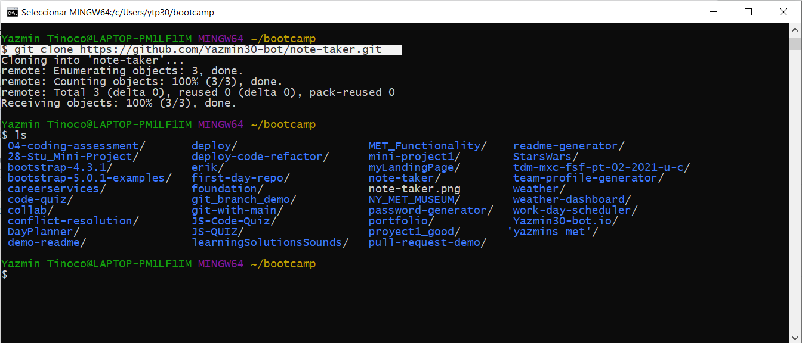
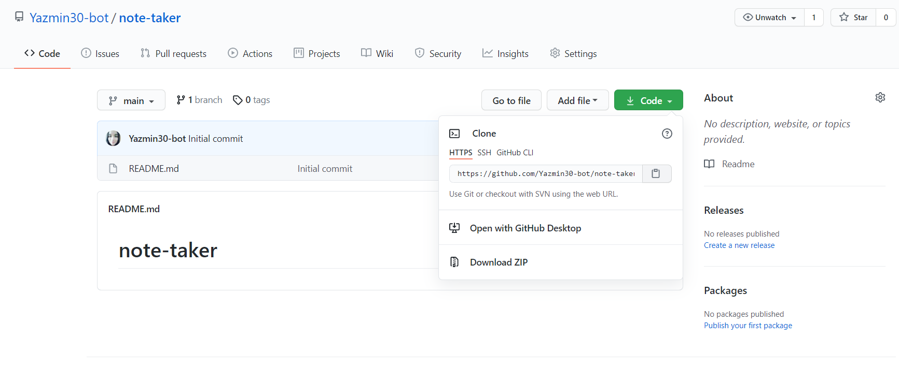

# Note Taker


## Description
  
  Create an application called Note Taker that can be used to write and save notes. This application will use an Express.js back end and will save and retrieve note data from a JSON file. 
  * Uses the [Express package](https://www.npmjs.com/package/express).

  * Uses the [UUID package](https://www.npmjs.com/package/uuid).

  * Uses the [Nodemon package](https://www.npmjs.com/package/nodemon).

  
  
## Table of Contents
  
  *[Installation](#installation)
  
  *[Usage](#usage)
  
  *[Build-With](#build-with)

  *[Links](#links)

  *[Author](#author)
  
  *[Contributing](#contributing)
  
  *[Questions](#questions)

## Installation
  * Go to the following link [https://github.com/Yazmin30-bot/note-taker](https://github.com/Yazmin30-bot/note-taker/) and clone it 
  * Go to Git-bash and page the github's with the following code
    ```
    $ git clone https://github.com/Yazmin30-bot/note-taker.git
    ``` 
    
  * When you first set up the project before installing any dependencies, make sure that your repo includes a package.json with the required dependencies. You can create one by running 
    ```
    npm init
  
    ``` 
  * For this project is needed to add the inquirer dependency to package.json file  
    ```
      "dependencies": {
        "express": "^4.16.4",
        "uuid": "^8.3.0"
        },
      "devDependencies": {
        "nodemon": "^2.0.4"
        }
    ``` 
    

  * To install necessary dependencies, run the following command:
    ```
    npm install
    npm install express
    npm install uuid
    npm install nodemon
    ```
## Usage
  * The application will be invoked by using the following command:

    ```bash
    node server.js
    ```
  * The following animation demonstrates the application functionality, Also you can find the video on the links section:  
    
   
## Build with 
  * [Javascript](https://www.javascript.com/) - `Javascript`
  * [NodeJs](https://nodejs.org/en/) - `NodeJs`

## Links
  * The URL of the deployed application.
  [https://morning-temple-42127.herokuapp.com/](https://morning-temple-42127.herokuapp.com/)
  * The URL of the database.
  [https://morning-temple-42127.herokuapp.com/api/notes/](https://morning-temple-42127.herokuapp.com/api/notes/)
  * The URL of the GitHub repository.                                         [https://github.com/Yazmin30-bot/note-taker/](https://github.com/Yazmin30-bot/note-taker/)

## Author 
  * **`Yazmin Tinoco`**   - [Yazmin30-bot](https://github.com/Yazmin30-bot/)

## Contributing
  Pull requests are welcome. For major changes, please open an issue first to discuss what you would like to change. 


  
## Questions
  If you have any questions about the repo, open an issue or contact me directly at ytip30@gmail.com.
  You can find more of my work at [Yazmin30-bot](https://github.com/Yazmin30-bot/).  
